# 🌱 PLANETA SANO

Sitio web informativo desarrollado con PHP, HTML, CSS y JavaScript, enfocado en la concientización ambiental mediante contenido educativo estructurado, navegación modular y componentes interactivos.

---

## 🎯 Objetivo del proyecto

Desarrollar una plataforma web que combine contenido educativo con una experiencia de usuario clara, moderna e interactiva, aplicando buenas prácticas de desarrollo web y organización de código.

---


## 📌 Descripción

**Planeta Sano** es una plataforma web diseñada para informar y sensibilizar a los usuarios sobre problemáticas ambientales como la huella ecológica, la contaminación y las acciones sostenibles.

El sistema organiza el contenido en módulos temáticos, permitiendo una navegación clara e intuitiva, complementada con recursos visuales e interactivos.

---

## 🚀 Funcionalidades

* 📚 Contenido informativo sobre temas ambientales
* 🌍 Secciones organizadas por temática (huella ecológica, contaminación, sostenibilidad)
* 🧭 Navegación estructurada mediante menú principal
* 🎞️ Carrusel de contenido visual (Bootstrap)
* 📂 Uso de acordeones para mostrar información detallada
* 🧩 Componentes reutilizables (header y footer)
* 🎥 Integración de contenido multimedia (videos e iframes)
* 📱 Diseño adaptable a diferentes dispositivos

---

## 🏗️ Estructura del proyecto

```
PlanetaSano/
│
├── public/
│   ├── css/
│   ├── js/
│   ├── imagenes/
│   ├── videos/
│   ├── paginas/
│        ├── contaminacionAgua.php
│        ├── contaminacionAire.php
│        ├── contaminacionSuelo.php
│        ├── contaminacionTermica.php
│        ├── huellaEcologica.php
│        ├── inventos.php
│        ├── medidasParaCuidarlo.php
│        ├── organizaciones.php
│        ├── sobreNosotros.php
│        └── productosAmigables.php
│   └── index.php
│
├── private/
│   ├── initialize.php
│   ├── functions.php
│   └── shared/
│        ├── header.php
│        └── footer.php
│
```

---

## 🧪 Tecnologías utilizadas

* **PHP** – Lógica del lado del servidor
* **HTML5** – Estructura del contenido
* **CSS3** – Estilos y diseño visual
* **JavaScript** – Interactividad
* **Bootstrap** – Componentes UI (carrusel, acordeones, layout)

---

## ⚙️ Instalación del proyecto

### 1. Clonar repositorio

```
git clone https://github.com/jennyfer0955/PlanetaSano.git
```

### 2. Instalar XAMPP

Descargar desde:
https://www.apachefriends.org/

Activar los servicios:

* Apache
* MySQL

Coloca el proyecto en:

```
C:\xampp\htdocs\PlanetaSano
```

### 3. Ejecutar el proyecto

Abrir en navegador:

```
http://localhost/PlanetaSano/public/index.php
```

---

## 🧠 Características técnicas

* Arquitectura modular mediante `includes`
* Separación de estructura y reutilización de componentes
* Organización escalable del proyecto
* Uso de `require_once` para inicialización del sistema
* Integración de componentes dinámicos del frontend

---

## 📸 Capturas del sistema

### Página principal

**WEB**

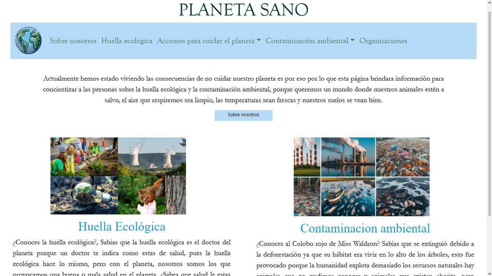

**MÓVIL**

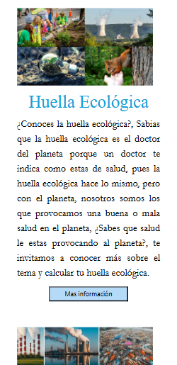

---

### Huella Ecológica

**WEB**

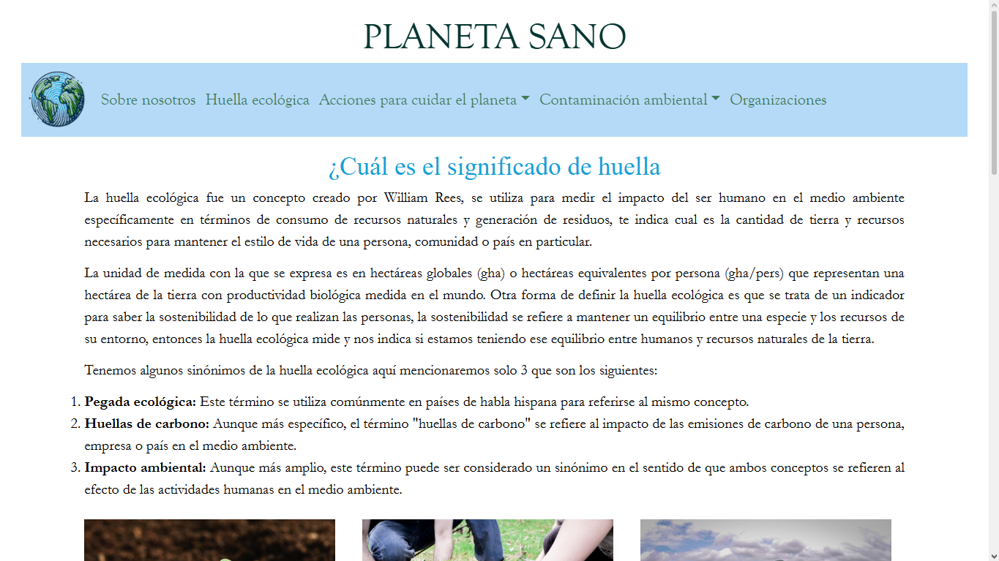

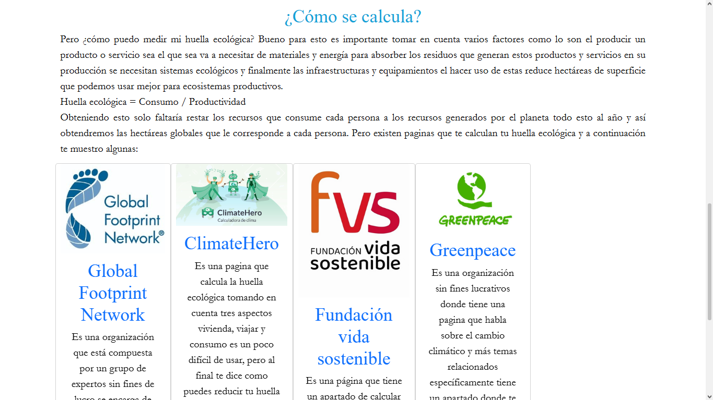

**MÓVIL**

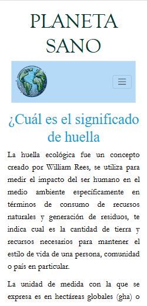

---

### Sobre Nosotros

**WEB**

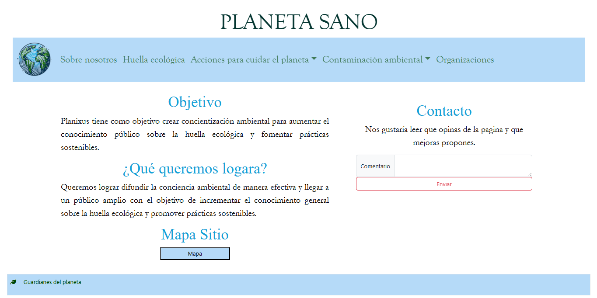

**MÓVIL**

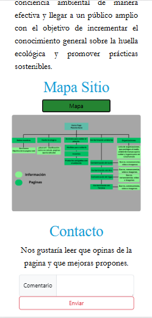

---

### Medidas para cuidar el planeta

**WEB**

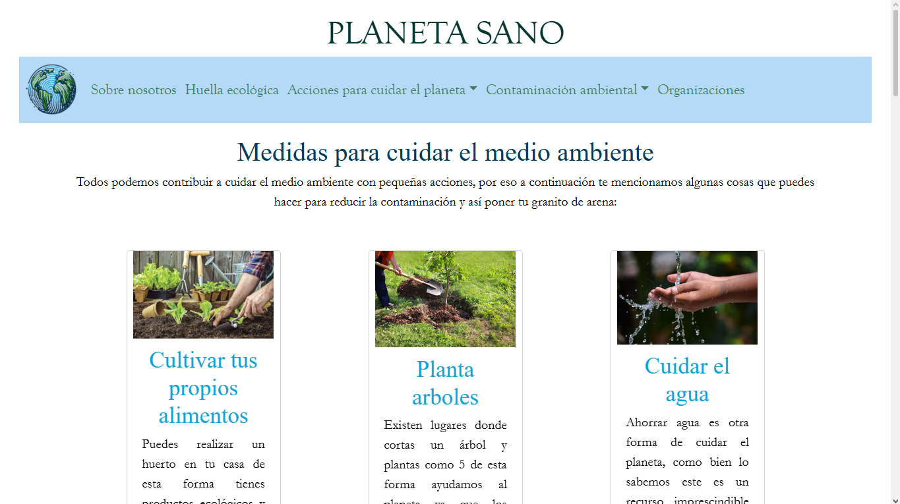

**MÓVIL**

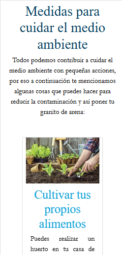

---

### Inventos para cuidar el medio ambiente

**WEB**

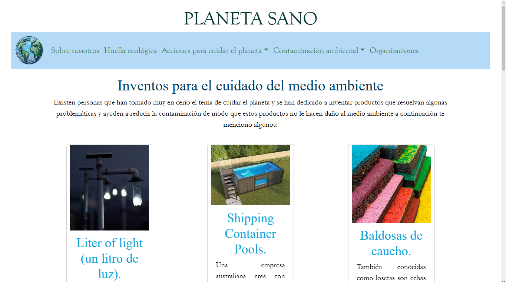

**MÓVIL**

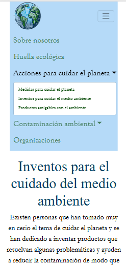

---

### Productos amigables con el medio ambiente

**WEB**

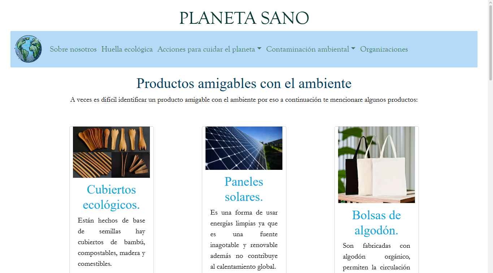

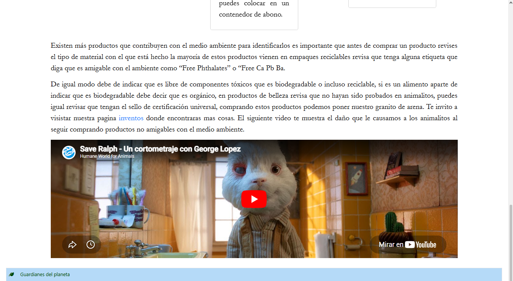

**MÓVIL**

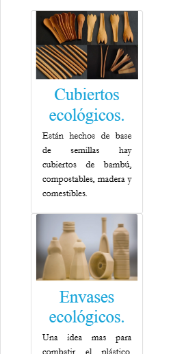

---

### Contaminación del Suelo

**WEB**

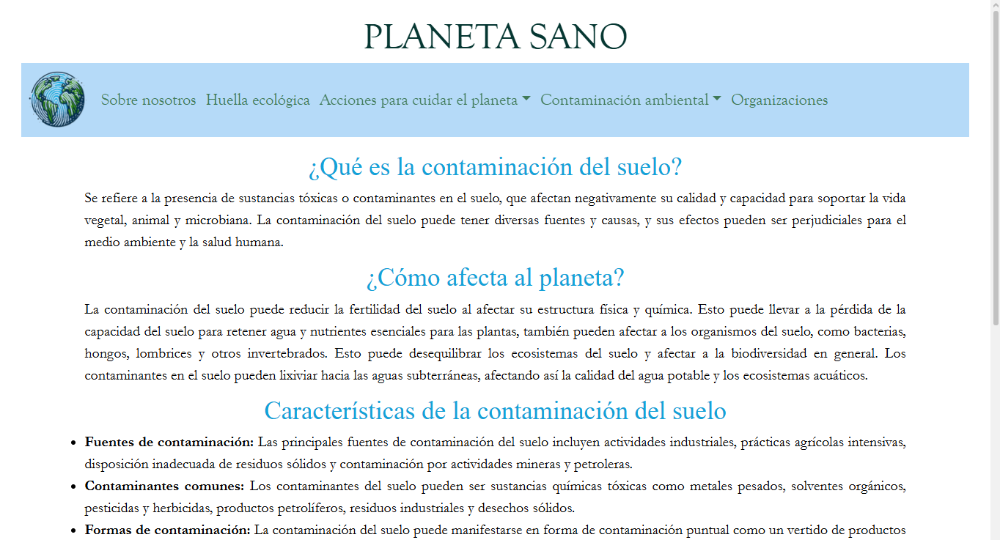

**MÓVIL**

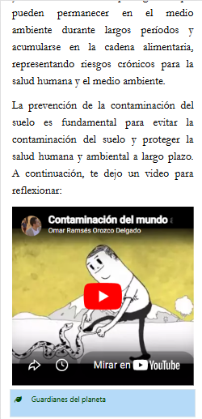

---

### Contaminación del Aire

**WEB**

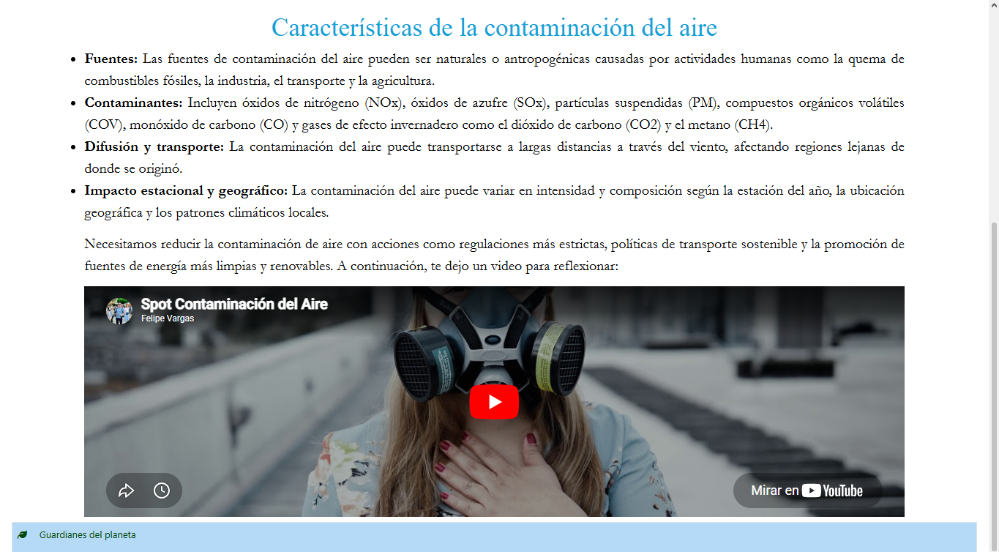

**MÓVIL**

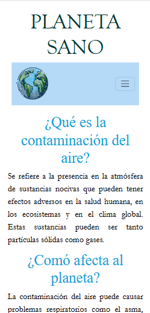

---

### Contaminación del Agua

**WEB**

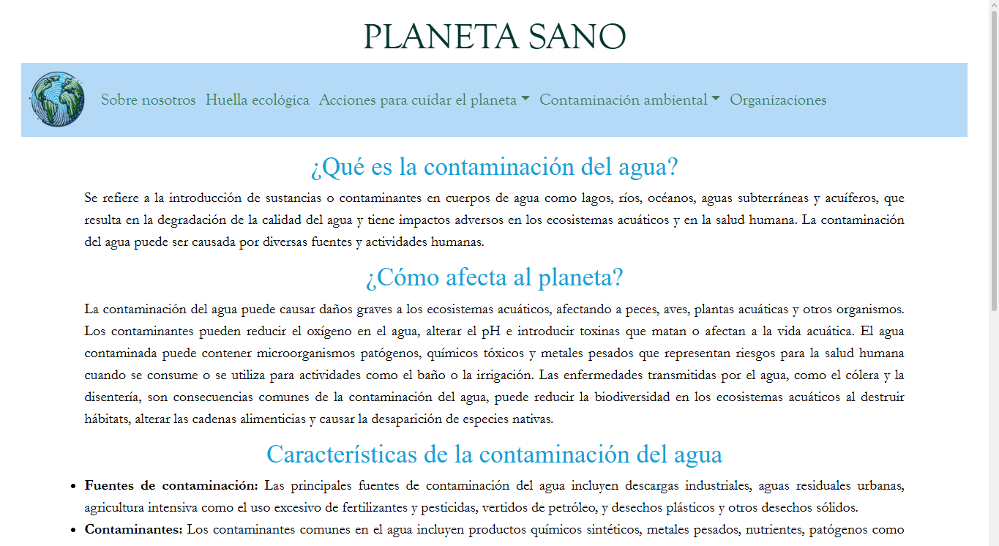

**MÓVIL**

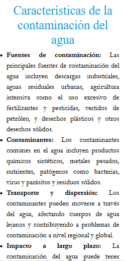

---

### Contaminación del Termica

**WEB**

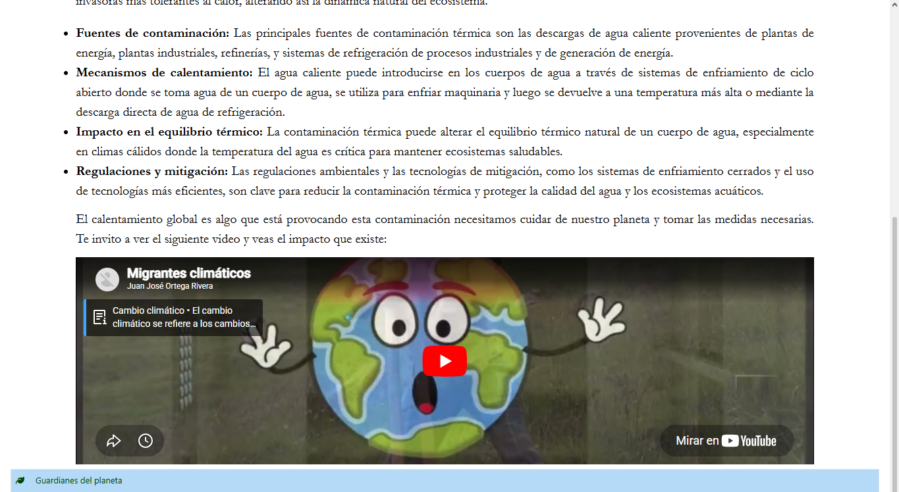

**MÓVIL**

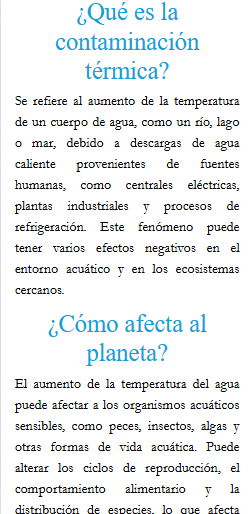

---

### Organizaciones

**WEB**

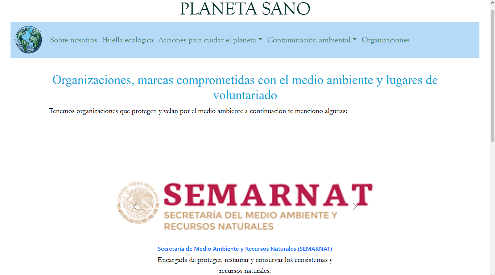

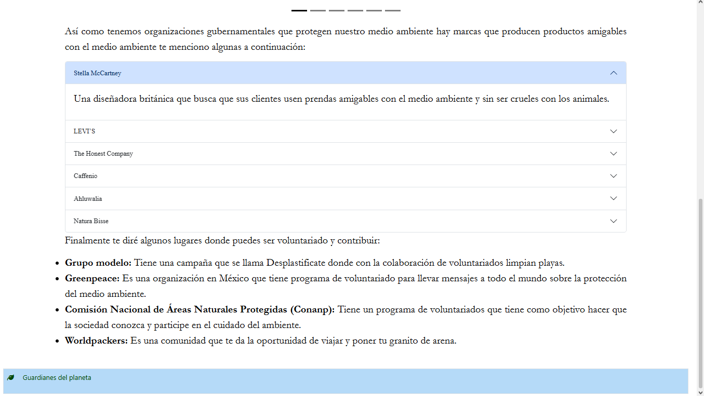

**MÓVIL**

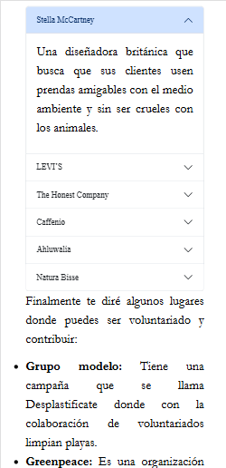

---

## 👩‍💻 Autor

Jennyfer Guadalupe Montes Romero
Desarrolladora Junior Fullstack

📫 Contacto: [jennyfermontes049@gmail.com](mailto:jennyfermontes049@gmail.com)

---

